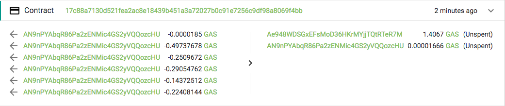

# Transactions - For Neo Smart Contracts
Neo uses a Unspent Transactions Outputs (UTXO) system, similar to Bitcoins.

As you can see, its possible to have multipule inputs and outputs.

## Transaction Inputs
Neo Docs: http://docs.neo.org/en-us/sc/fw/dotnet/neo/TransactionInput.html

A Transcations Inputs contain all the **Previous TX Hash**, and the **index** of the output from the previous transaction.

## Transaction Outputs
Neo Docs: http://docs.neo.org/en-us/sc/fw/dotnet/neo/TransactionOutput.html

A Transactions Outputs contain all the **AssetID** being sent, the **ScriptHash** of the recieving address, and the **Value** of the assets being sent.

**Code Snippet Example:**
[TransactionOutputs.cs](./csharp-transactions/TransactionOutputs.cs)

